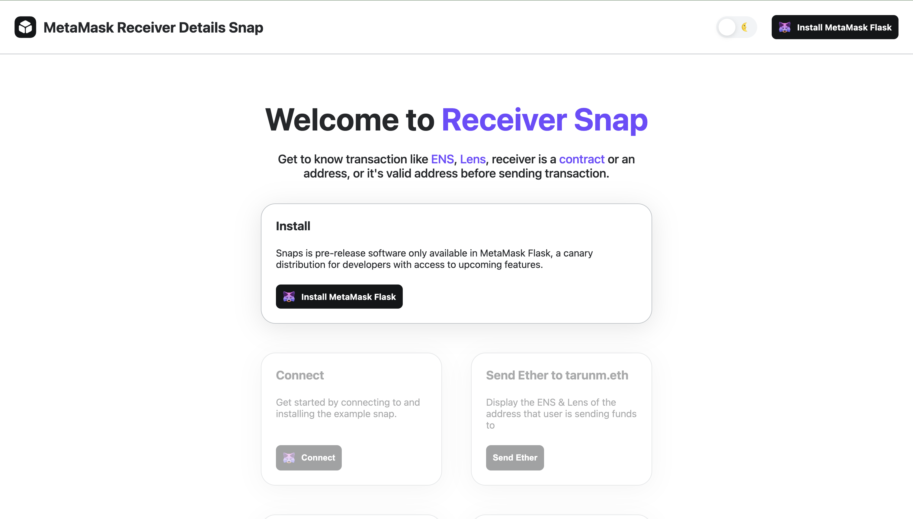
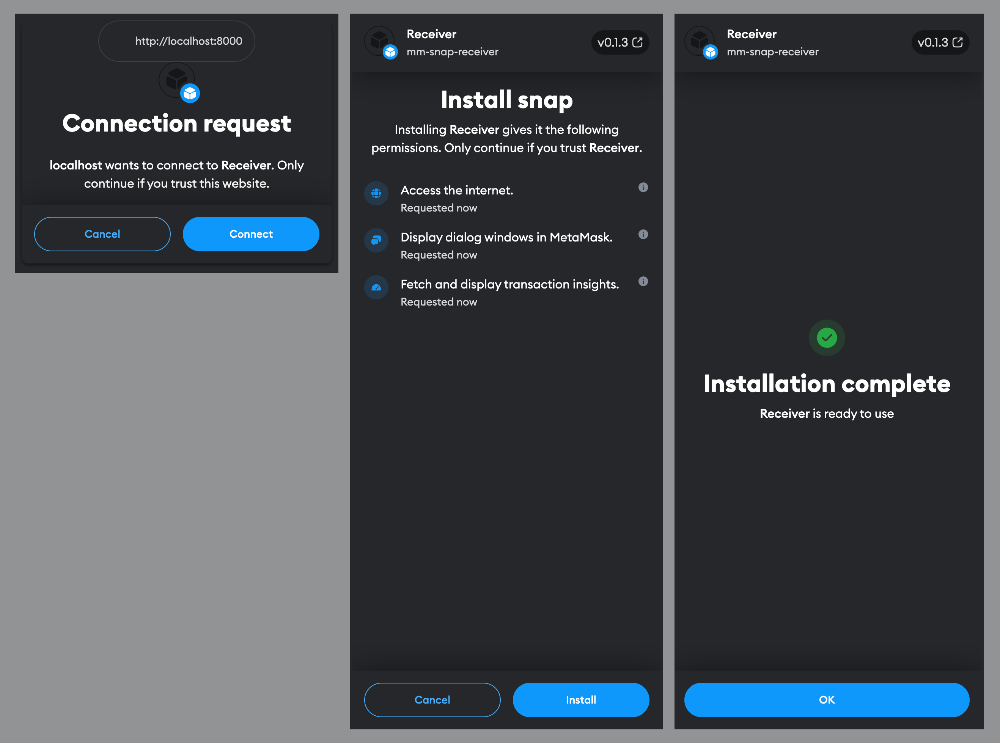
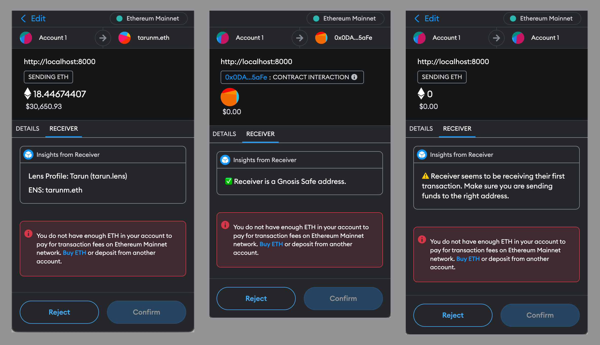

# MetaMask Snap: Receiver Details

Receiver Details is a MetaMask snap that shows more details about receiver including their ENS, Lens, Unstoppable Domains, or if it is a new address, or Gnosis Safe.

## What is Receiver Details Snap?

In today's world, we are always stressed about sending funds using MetaMask as we are interacting with users using addresses. This is a major reason for stress and anxiety for people interacting with MetaMask. Also, there have been many cases where people have lost their funds due to sending funds to

- a new address
- a Gnosis Safe on a different network than receiver network (https://decrypt.co/102377/ethereum-layer-2-solution-optimism-loses-20-million-tokens-in-interlayer-snafu)

By using Receiver Details Snap, users can validate the address before even sending funds. We show details like

- An ENS address linked with address on all the networks even if user is sending funds on Polygon, Linea, Optimism and others.
- A Lens profile (name and handle)
- Unstoppable Domains
- Check if it's a new address
- If receiver is Gnosis Safe, then show it's safe to send funds

## Getting Started

There are 3 parts of Receiver MetaMask Snap

1. Snap - code for MetaMask Snap
2. APIs - API used to retrieve details about receiver
3. Site - Used to install and interact with snap for testing

We are using `yarn workspaces` to manage these projects.

### Initial Setup

We are using Node v18.0.0 for development. If you are using `nvm` then you can run `nvm use` command to change Node version.

You need install dependencies using `yarn install` before running the project for development.

### Run the project locally

To run this snap locally, you need to run following command

```sh
yarn start
```

By running this command, there are 3 projects as mentioned above boots up.

Now you can interact with snap from http://localhost:8000/ endpoint. This is how the site looks like:



## Testing Snap

### Install Snap
> Snaps are only supported in developer version on MetaMask. You need to install MetaMask Flask from [here](https://metamask.io/flask/) before proceeding.

Once you open up [snap website](http://localhost:8000/) in browser as shown in above step, you need to click on `Connect`. This will ask you to install Receiver Details Snap in your MetaMask. Click on `Connect` and `Install` as shown in below given screenshots.



### Use Snap

Once Snap is installed. You can send transaction to any address and view their details.

There are 4 example transactions we have given for instant try:

- Click "Send Ether" button and you will see that the receiver is `tarunm.
eth`.
- Click "Send USDC" can be used to check ERC20 transfers. You will see that the receiver is `tarunm.eth`.
- Click "Send to Gnosis Safe" button and you will see that the you can safely send funds to this address as it is Gnosis Safe.
- Click "Send" button and the snap will give you a warning to check address as it's `a new address`. We decide this by checking addresses' transactions count.



## Future Roadmap

- [] Add support for Etherscan to detect receiver contract type.
- [] Add support to show receiver's profile picture from ENS/Lens


## Feedback and Suggestions

If you have any feedback or suggestion, feel free to [open an issue](https://github.com/tarunmangukiya/mm-snap-receiver-details/issues).
